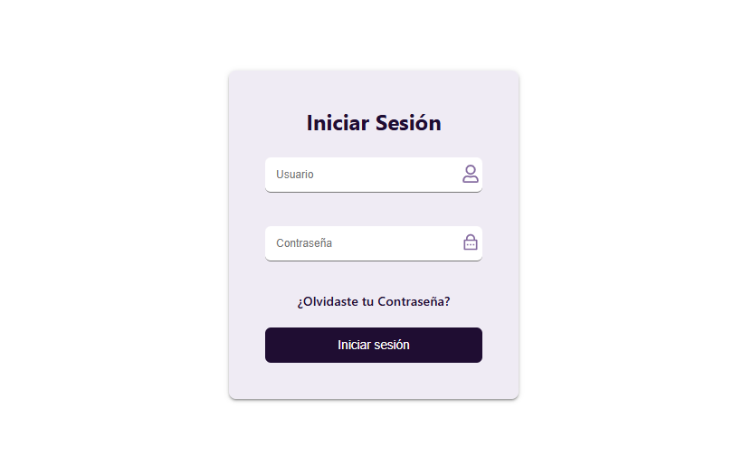
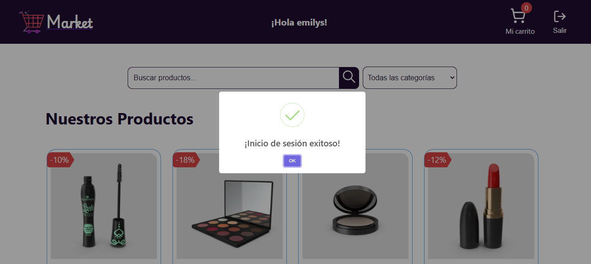
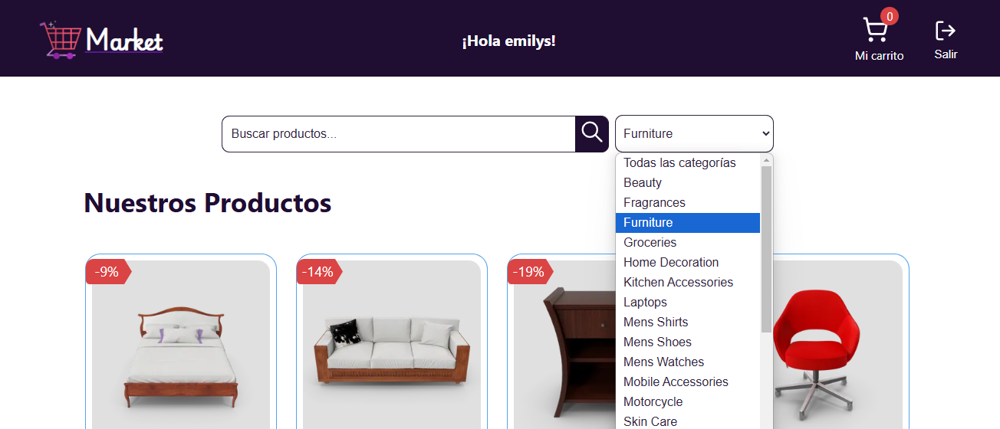
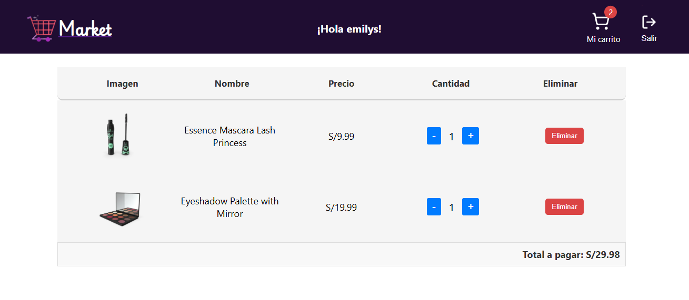
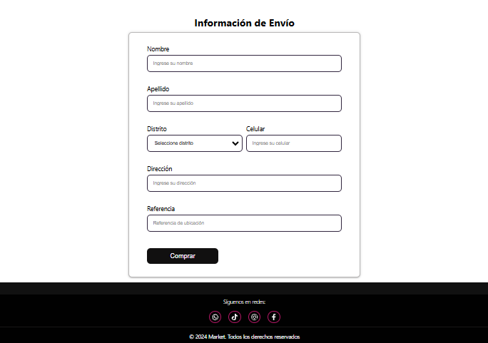

# Market App – Testing Challenge with Jest

## 📌 Descripción del Proyecto
Este proyecto implementa pruebas automáticas en una aplicación desarrollada con **React + TypeScript**, enfocada en buenas prácticas, modularización y cobertura de código usando **Jest** y **React Testing Library**.

---

## 🎯 Objetivos del Proyecto

### Migración y Optimización
- Migración del proyecto a **React** usando componentes funcionales.
- Aplicación de buenas prácticas en la estructura del proyecto.
- Uso de **TypeScript** para tipado fuerte y mantenible.

### Pruebas Unitarias con Jest
- Implementación de tests para componentes, hooks, reducers y contextos.
- Correcta definición y organización de los tests.
- Cobertura superior al **70%** del proyecto.

---

## 🚀 Funcionalidades Principales

### Renderizado de Productos
Los productos se muestran dinámicamente gracias a la integración con el API.

### Buscador (Search)
Filtro de productos en tiempo real.

### Filtrado por Categorías
Selección sincronizada con el resto de la UI.

### Carrito de Compras
Agregar, eliminar y modificar cantidades, con actualización inmediata.

### Formulario de Registro
Validación de campos y creación de usuario.

---

## 🔐 Credenciales para Pruebas

Para ingresar al dashboard:

- Usuario: emilys
- Contraseña: emilys pass


### 🔹 Pantalla de Inicio de Sesión


### 🔹 Pantalla: Inicio de sesión con éxito

### 🔹 Pantalla: Inicio con filtrado

### 🔹 Pantalla: Carrito de compras

### 🔹 Pantalla: Formulario de envío


---

## 🗂️ Estructura de Carpetas

```plaintext
📦 src
├── 📁 assets
│
├── 📁 component
│   ├── button
│   │   ├── __test__
│   │   │   └── button.test.tsx
│   │   └── button.css
│   ├── footer
│   ├── input
│   ├── mainLayout
│   └── navbar
│
├── 📁 context
│   ├── __test__
│   │   └── appContext.test.tsx
│   ├── appContext.tsx
│   └── cartContext.tsx
│
├── 📁 domain
│   ├── appState.domain.ts
│   ├── category.domain.ts
│   └── product.domain.ts
│
├── 📁 hoc
│
├── 📁 mocks
│
├── 📁 pages
│   ├── home
│   └── products
│
├── 📁 reducer
│   ├── __test__
│   │   ├── appReducer.test.tsx
│   │   └── cartReducer.test.tsx
│   ├── appReducer.tsx
│   └── cartReducer.tsx
│
├── 📁 services
│   ├── api
│   ├── product.service.ts
│   └── mappers
│       └── product.mappers.ts
│
├── 📁 shared
│   ├── action
│   │   └── __test__
│   │       └── appAction.test.tsx
│   ├── hooks
│   │   ├── __test__
│   │   │   ├── useCart.test.tsx
│   │   │   ├── useCartStorage.test.tsx
│   │   │   └── usePlace.test.tsx
│   ├── utils
│   │   ├── formatPrice.ts
│   │   └── validation.ts
│
├── 📁 types
│   ├── app.types.ts
│   └── cart.type.ts
│
├── 📁 styles
│   └── style.css
│
├── App.tsx
├── main.tsx
├── index.css
└── index.html

## 🛠️ Tecnologías Utilizadas

- **React**
- **TypeScript**
- **Jest**
- **React Testing Library**
- **Vite**
- **Hooks**
- **Context**
- **CSS**

---

## ⚙️ Instalación y Uso

### Clonar el repositorio
```bash
git clone https://github.com/sofia-torres-v/BOOTCAMP-FRONTEND-REACT-NTT.git
cd BOOTCAMP-FRONTEND-REACT-NTT

npm install

npm run dev

